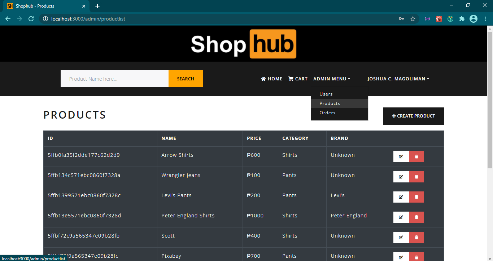
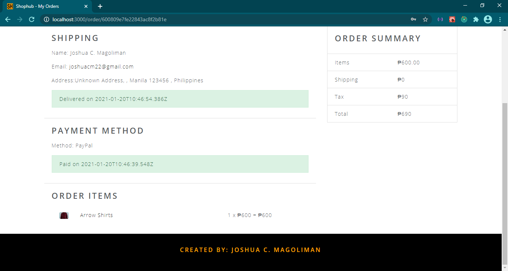

# ELECTRONIC COMMERCE WEB APPLICATION

* Purpose: My Project
* Responsive Web Design: Yes
* Type of Application: Web Application

* Front-End Technologies i used  
-HTML 5 (Structure of the web)  
-CSS 3 (Presentation of the web)  
-LESS (CSS Pre-processor)  
-Google fonts: open sans (A font library)  
-Font-awesome v5.14.0 (Font and icon toolkit)  
-Bootstrap v4.5.2 (CSS Framework)  
-Axios v0.20.0 (HTTP Library)  
-React v16.13.1 (Javascript Library)  
-React-bootstrap v1.3.0 (Front-end framework rebuilt for React)  
-React-helmet v6.1.0 (A simple component that makes it easy to manage and dynamically set what's in the document's head section)  
-React-paypal-button-v2 v2.6.2 (A React component to provide an interface into the Paypal Checkout API)  
-React-redux v7.2.1 (A React binding for Redux. It lets your React components read data from a Redux store, and dispatch actions to the store to update data)  
-React-router-dom v5.2.0 (It contains the DOM bindings for React Router. In other words, the router components for websites)  
-React-router-bootstrap v0.25.0 (Integration between React Router and React Bootstrap)  
-Redux v4.0.5 (A 3rd party library act as a state manager)  
-Redux-devtools-extension v2.13.8 (A web browser extension for redux)  
-Redux-thunk v2.3.0 (A middleware that allows you to directly access to built-in method called dispatch() so that you can make asynchronous calls from your actions)  

* Back-End Technologies i used  
-Express v4.17.1 (A Server Side Web Application Framework)  
-Express-async-handler v1.1.4 (A simple middleware for handling exceptions inside of async express routes and passing them to your express error handlers)  
-Node.js v14.15.1 (JavaScript Runtime. That allows to run JavaScript outside of the web browser)  
-Bcryptjs v2.4.3 (A password-hashing function)  
-Colors v1.4.0 (A JavaScript library for immutable color for Node.JS console)  
-Dotenv v8.2.0 (A zero-dependency module that loads environment variables from a . env file into process. env)  
-Jsonwebtoken v8.5.1 (JWT is an open standard that defines a compact and self-contained way of securely transmitting information between parties as a JSON object)  
-Mongoose v5.10.6 (An Object Data Modeling (ODM) library for MongoDB and Node.js)  
-Morgan v1.10.0 (A HTTP request logger middleware for Node. js. It simplifies the process of logging requests to your application)  
-Multer v1.4.2 (A Node.js middleware for handling multipart/form-data , which is primarily used for uploading files)  
-MongoDB Compass (A GUI for mongoDB)  
-MongoDB (A Non-Relational Document-based Database)  

<h2> Customer Account that already created </h2>  
-Email Address: joanna@gmail.com  
-Password: 123  
-Full Name: Joanna Mae C. Magoliman  

<h2> Admin Account that already created </h2>  
-Email Address: joshuacm22@gmail.com  
-Password: JCM  
-Full Name: Joshua C. Magoliman  

<h2> Customer User Interface Screenshots </h2> 
  
  
  
  
  
  
  
  
  
  
  
	
  
	  
  
				  
  
  
  
  
  
  
  
	
  
	  
  
				  
  
  
  
  
  
  
  
  
  
	
  
	  
  
	
  
	
  

  
  
  
  
  
  
  
	
  
	  
  
	
  

<h2> Admin User Interface Screenshots </h2> 

  

  
  
  
  
  
  
  
  
  
	
  
	  
  
	
  
	
  

  
  
  
  
  
  
  
	
  
	  
